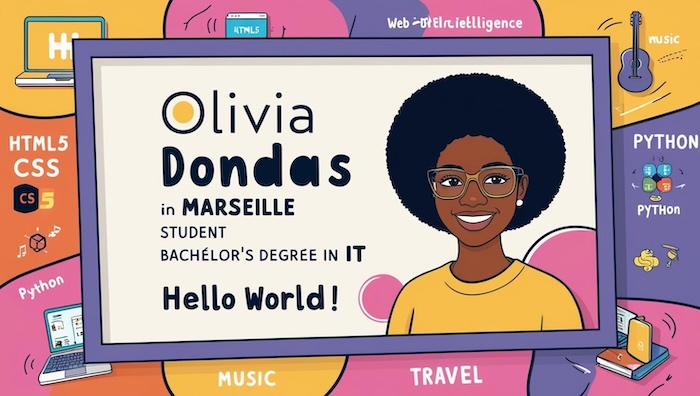

# 💫 About Me:
**Hello world!**  🔭 I’m currently working with **PHP** 🚀  🌱 I’m currently learning Python programming and building a strong foundation in web development.  👯 I’m looking to collaborate on web development projects to enhance my skills.  🤔 I’m looking for help with finding a web development apprenticeship to kickstart my career.  💬 Ask me about my journey in IT, my love for music, or my passion for discovering new restaurants 🍽️🎶.  	

## 🌐 Socials:
      

# 💻 Tech Stack:
      
# 📊 GitHub Stats:
 
 

## 🏆 GitHub Trophies

### ✍️ Random Dev Quote

### 🔝 Top Contributed Repo

  ## 💰 You can help me by Donating
   

